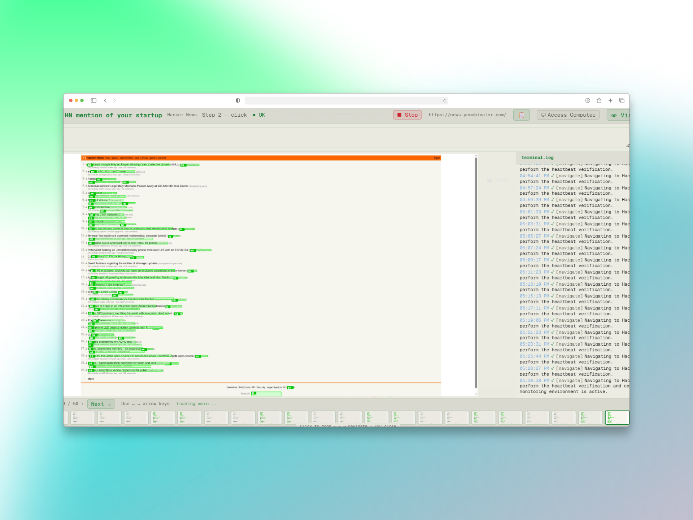
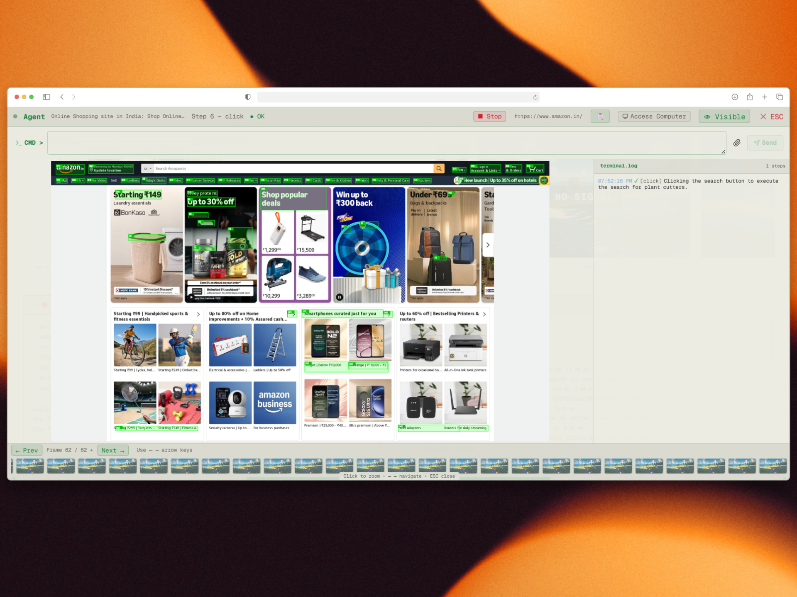

<div align="center">

# 😸 Magine - A Terminal-Styled AI Orchestration Platform

### _iMagine what your AI could do while you sleep_ 🐾

**analyze anything. automate everything. from your terminal.**

<br />

<br />
<a href="https://chromewebstore.google.com/detail/magine-bridge/nbnppnlaacbhaknaikpkljfdjfelbbee" target="_blank"></a>&nbsp;
<a href="https://www.producthunt.com/products/magine?embed=true&amp;utm_source=badge-featured&amp;utm_medium=badge&amp;utm_campaign=badge-magine" target="_blank" rel="noopener noreferrer"></a>&nbsp;
<a href="https://addons.mozilla.org/en-US/firefox/addon/magine-bridge" target="_blank"></a>
<br />
<sub>The browser extensions are completely optional - they only help sync your signed-in sessions with Magine.</sub>
<br />

[Live Demo](https://magine.cloud) · [Docs](https://magine.cloud/docs) · [Research](https://zeupiter.com/research) · [Issues](https://github.com/S4nfs/Magine/issues)

</div>

---

## Table of Contents

- [What is Magine?](#what-is-magine)
- [Product Overview](#product-overview)
- [The Story of Magine](#the-story-of-magine)
- [Hayai Vision and the AGP Workflow](#hayai-vision-and-the-agp-workflow)
- [How Magine Works](#how-magine-works)
- [Features](#features)
  - [GitHub Profile Analysis](#github-profile-analysis)
  - [Sight-Driven Agents](#sight-driven-agents)
  - [Smart Scheduling](#smart-scheduling)
  - [Heartbeat Agents](#heartbeat-agents)
  - [Human Mode](#human-mode)
  - [Terminal Experience](#terminal-experience)
  - [Browser Session Import](#browser-session-import)
  - [Token Economy](#token-economy)
  - [Authentication](#authentication)
- [CatCode Coding Agents](#catcode-coding-agents)
  - [Clone, Plan, Approve, Pull Request](#clone-plan-approve-pull-request)
  - [Catcode CLI](#catcode-cli)
- [Terminal Commands](#terminal-commands)
  - [Core Commands](#core-commands)
  - [Profile Card Customization](#profile-card-customization)
  - [Account and Tokens](#account-and-tokens)
  - [AI Browser Agents (CatBot)](#ai-browser-agents-catbot)
  - [CatCode Commands](#catcode-commands)
  - [Browser Session Import (Magine Bridge)](#browser-session-import-magine-bridge)
  - [Webhooks and API](#webhooks-and-api)
  - [Settings and UI](#settings-and-ui)
- [AI Browser Agents](#ai-browser-agents)
- [REST API and Webhooks](#rest-api-and-webhooks)
- [Pricing](#pricing)
- [Security and Privacy](#security-and-privacy)
- [Roadmap](#roadmap)

---

## What is Magine?

**Magine** is a retro-terminal web interface for deep GitHub profile analysis, AI-powered browser automation, and scheduled agent workflows - all controlled from a single command-line-inspired UI.

Think of it as your personal command center: type a GitHub username and get an instant deep dive on a developer, or spin up autonomous browser SDAs (Sight-Driven Agents) that can see, navigate, interact, and report back - on a schedule or in real time. Send scheduled posts to LinkedIn, get a summary of your X (Twitter) feed, triage your Gmail inbox, let a coding agent open a pull request on your repo, or automate any web task you can _iMagine_.

Prefer buttons to a command line? Flip the **Human | Machine** switch and every command becomes a form - [see Human Mode](#human-mode).

---

## Product Overview

<p align="center">
  
  
</p>
<p align="center"><sub><em>Left: the Magine architecture pipeline &nbsp;·&nbsp; Right: SDA browser sessions - agents that can see</em></sub></p>

<p align="center">
  
  
</p>
<p align="center"><sub><em>Left: the Hayai computer vision model doing its task &nbsp;·&nbsp; Right: AGP tracing web elements - the Autonomous GUI Pilot</em></sub></p>

---

## The Story of Magine

> _iMagine a world where AI agents can actually see._

Most AI agents today are **blind as a bat** 🦇. They rely on APIs, structured selectors, and DOM scraping - meaning the moment a website changes a class name or moves a button, everything breaks. That fragility is why autonomous browser automation has been stuck in demo mode for years.

**Magine** was born to fix this. Instead of teaching agents to parse HTML, we built **Sight-Driven Agents (SDAs)** - autonomous browser agents that literally _see_ the screen. They take real-time frames of the page, feed them to our vision models, plan their next move based on what they observe, and then act - just like a human would.

### Why Cats?

Cats see things humans miss. Just as cats perceive movements invisible to us, Magine's SDAs perceive web interfaces that traditional agents cannot navigate - login walls, CAPTCHAs, dynamic pages, and visual content with no API. Cats are independent, observant, and self-sufficient. So are Magine's SDAs - which is why we call them **catbots**.

### How SDAs Work

An SDA creates **Action Streams**: a continuous loop of frame capture → vision-model planning → GUI and API actions executed. Every step is recorded, so you can scrub through an SDA's work frame by frame.

### What Makes Them Different

- **They see, not scrape** - SDAs work from what is on screen, so they survive redesigns, canvas apps, and pages with no API
- **They learn** - agents keep short-term memory within a run and long-term memory across runs, and improve from their own successes and failures
- **They are isolated** - every user runs in a private, sandboxed browser environment with its own cookies, storage and fingerprint
- **They are fast** - browsers boot lazily, live views stream without lag, and long runs compact their own context to keep token costs down
- **Mixture of Experts** - Magine's native models, cloud models and specialised vision models run in parallel for faster, more accurate decisions
- **GitHub Productivity Tracker** - beyond browsing, Magine analyses developer profiles with AI-driven scoring and market-value estimation

### Where SDAs Are Used

SDAs already power real workloads on providers like [Zeupiter](https://zeupiter.com) - from automated cost management to Gmail triage to full **vibe deployments**: describe what you want in plain English, and an SDA plans, tests, and ships it.

---

## Hayai Vision and the AGP Workflow

Every SDA can drive a page one of three ways, switchable per agent:

| Workflow  | How it sees the page                              | Best for                                                                  |
| --------- | ------------------------------------------------- | ------------------------------------------------------------------------- |
| `classic` | Reads the page structure                          | Simple, well-behaved sites                                                |
| `cdp`     | Talks to the browser directly - faster, lighter   | Speed on standard sites                                                   |
| `agp`     | **Looks at the screen** - no page code at all     | Canvas apps, heavily scripted sites, anything a DOM-based agent can't use |

**AGP (Autonomous GUI Pilot)** is Magine's DOM-free workflow. At every step it captures a clean frame of the page and hands it to **Hayai Vision**, Magine's own computer-vision model, trained to find every interactive control on a screen in a single pass - buttons, fields, links, toggles, menus - the way a person scanning the page would. AGP numbers those controls on the frame and asks the planner one narrow question: _which one, and what action?_ The answer lands on real screen coordinates, so nothing depends on class names, selectors, or a site's markup staying still.

- **Works where DOM agents can't** - canvas apps, PDF viewers, custom widgets, and pages that actively fight automation
- **Degrades gracefully** - if the detector is unsure, AGP falls back to classical vision + OCR so the step still completes
- **Gets better with every run** - successful and failed actions feed back into Hayai Vision's training, so the model improves from real pages rather than static datasets
- **Transparent** - the run log tells you which detector handled each step

```bash
catbot create sda <prompt>          # a new vision-first agent
catbot workflow <name> agp          # switch an existing agent to the vision workflow
```

📖 **How Hayai Vision was built** - why interface perception is not ordinary object detection, the data flywheel behind the model, and where it is heading: read the story at **[zeupiter.com/research](https://zeupiter.com/research)**.

---

## How Magine Works

```
┌─────────────────────────────────────────────────────┐
│  magine terminal                                    │
│  ─────────────────────                              │
│  > analyze torvalds                                 │
│                                                     │
│  Fetching GitHub data...                            │
│  Running AI analysis...                             │
│  ┌───────────────────────────────────────────┐      │
│  │ ★ Profile Score: 98/100                   │      │
│  │ 📊 Top Languages: C, Shell, Perl          │      │
│  │ 🔥 Contribution Streak: 4,021 days        │      │
│  │ 💡 AI Insight: "The most prolific..."     │      │
│  └───────────────────────────────────────────┘      │
│                                                     │
│  > catbot create "daily-monitor"                    │
│  Agent created. Use `catbot task` to assign work.   │
│                                                     │
│  visitor@magine:~$ _                                │
└─────────────────────────────────────────────────────┘
```

1. **Type** a GitHub username, a task, or a command - or click it in Human mode
2. **Watch** SDAs work in the live viewer, frame by frame, or take the controls yourself
3. **Review** results in `catbot-output.log`, ask follow-up questions, and schedule it to run again

---

## Features

### GitHub Profile Analysis

_iMagine knowing any developer in seconds_

- **Instant analysis** - type any GitHub username to get a comprehensive profile breakdown
- **AI-powered insights** - deep analysis of contributions, repos, and coding patterns
- **Profile scoring** - 0–100 rating based on activity, impact, and community engagement
- **Beautiful cards** - generate shareable, embeddable GitHub profile cards with 30 themes - no résumé building
- **Your timezone, not the server's** - Most Active Hour and Busiest Time are shown in your own local time

### Sight-Driven Agents

_iMagine an army of cats browsing for you_

Each agent gets its own real cloud browser inside a sandbox that is yours alone. Agents can:

- **Browse autonomously** - navigate real websites using the `classic`, `cdp` or `agp` workflow
- **Show their work live** - watch every step in the SDA Live Viewer
- **Hand you the controls** - open the agent's live screen, take over with your own mouse and keyboard, then release
- **Take natural-language tasks** - _"go to LinkedIn and check my notifications"_
- **Work on any site** - Gmail, LinkedIn, YouTube, X, Amazon, and anything else with a screen
- **Ask for credentials safely** - prompt-based auth when a login is needed, never stored on disk
- **Replay every run** - frame-by-frame review with thumbnail navigation
- **Use your files** - reference uploads with `#report.pdf` and they are attached to the run

**Quick tasks - just tell CatBot what to do:**

```bash
catbot do "check NVIDIA stock price on Yahoo Finance"
catbot do "order Sony WH-1000XM5 headphones from Amazon and pay using my card"
catbot do "send an email on Gmail to Arthur about yesterday's meeting"
catbot do "search arXiv for latest transformer-based LLM papers from 2026"
catbot do "what's the latest Veritasium video about on youtube"
catbot do "apply to senior frontend developer jobs on Indeed"
catbot do "research the best Mumbai street food on Reddit"
catbot do "check what's happening on my X (Twitter) feed"
```

For work you want to keep, name and save an agent with `catbot create`.

### Smart Scheduling

_iMagine your agents running while you nap_

- **Natural language scheduling** - say _"every weekday at 9am"_ instead of writing cron expressions
- **AI cron parser** - LLM-powered conversion of human language to precise schedules
- **Preset schedules** - hourly, daily, twice daily, weekdays, every 6h/12h
- **Heartbeat mode** - reactive watchers that fire the moment a page changes (see below)
- **Timezone-aware** - schedules respect your local timezone

### Heartbeat Agents

_iMagine an agent that wakes up only when something happens_

Heartbeat agents are **reactive**, not scheduled. Instead of running on a timer, the agent keeps an eye on a page and reacts within seconds of a real change - a new email, a status flip, a fresh notification. Only then does the full agent wake up with your action prompt and spend regular agent tokens.

```bash
# Minimal - `every` and `url` are OPTIONAL
catbot create heartbeat \
  watch "new unread email" \
  do "summarise it in 2 lines and reply 'on it' if it asks a question"

# With url (recommended) and a custom safety-net interval
catbot create heartbeat \
  watch "new unread email at the top of the inbox" \
  do "open the newest unread email, summarise it in 2 lines, and reply 'on it' if it asks a question" \
  every 60s \
  url https://mail.google.com/
```

> **Units**: `every <n>s`, `every <n>m`, `every <n>h`, or `every [5 minutes]`. A bare number is seconds. Range: 10s–5m.

- **Cost**: 2 🐱 (vs 1 🐱 for a regular agent) - a browser tab stays alive continuously
- **`every` is a ceiling, not a timer** - default 60s; it only forces a check for changes the watcher can't see (canvas, video, cross-origin frames). Real changes fire faster
- **`url` is optional** but recommended - the watcher returns to that page if the tab drifts
- **Quote `watch` and `do`** - bare text is rejected so a typo can't silently become the action
- **Coalescing** - three changes during one running action produce **one** wake-up that handles all three
- **Backoff** - transient errors back off (30s → 1m → 5m → 15m → 60m) so a flaky page can't drain your wallet

Use it for inboxes, dashboards, notification feeds, queue UIs, status pages, ticket boards - anything where the right moment to act is "whenever something new shows up".

### Human Mode

_iMagine Magine without the command line_

A **Human | Machine** switch in the top-right of the terminal turns every command into a labelled button or a small form: creating an SDA becomes a name and a description; scheduling becomes a dropdown. Nothing is left out - the same tabs cover SDAs, CatCode, your account and, for administrators, the whole platform. It works before you sign in too (visitors get a Welcome tab with sign-in, registration and the free developer card), and every button runs the exact command the terminal would, so the two modes can never disagree. Flip back to **Machine** any time for the full command line, autocomplete and history.

### Terminal Experience

_iMagine your perfect terminal aesthetic_

- **Light and dark modes** - clean light theme inspired by GitHub, plus 30 card themes
- **Voice commands** - click the paw button or type `voice` to speak commands
- **Draggable panels** - arrange your workspace with resizable terminal windows
- **Command history** - arrow keys to navigate previous commands; `#` autocompletes your files, `@` your agents
- **Tab status light** - the browser tab shows a yellow dot while an SDA is working and a green one when it finishes while you're away, so you know when to come back
- **Mobile responsive** - full experience on phones and tablets

### Browser Session Import

_iMagine your CatBot is already logged in_

<p align="left">
  <a href="https://chromewebstore.google.com/detail/magine-bridge/nbnppnlaacbhaknaikpkljfdjfelbbee" target="_blank"></a>
  &nbsp;&nbsp;
  <a href="https://addons.mozilla.org/en-US/firefox/addon/magine-bridge" target="_blank"></a>
</p>

The **Magine Bridge** extension (Chrome, Edge, Brave and Firefox) shares the sites you are already signed in to with your agents, so they skip the login wall. It is entirely optional.

- **Per-domain consent** - you pick each site to sync, or share everything you're signed in to with one click
- **Single-use pairing codes** that expire in 60 seconds
- **Encrypted at rest** (AES-256-GCM) with a 7-day auto-expiry
- **Keep in sync** - optional automatic refresh every 6 hours
- **Cascade revoke** - `browser unlink` deletes every session for that profile

### Token Economy

_iMagine unlimited analysis power_

- **Free tier** - every visitor gets tokens to start analysing
- **Token consumption** - different actions cost different amounts
- **Top-up** - purchase additional tokens when you need more
- **Blurred previews** - see what premium analysis looks like before buying

### Authentication

_iMagine secure access everywhere_

- **Local accounts** - register with username/password
- **Google OAuth** - one-click sign in with Google
- **QR login** - scan a QR code from your phone to log in on desktop
- **Session management** - secure token-based sessions

---

## CatCode Coding Agents

_iMagine an agent that clones your repo, proposes a plan, and opens the pull request_

CatCode gives you isolated project workspaces and a coding agent that works on real repositories - from the terminal, in the in-browser editor, or bridged to your own machine.

### Clone, Plan, Approve, Pull Request

```bash
catcode clone https://github.com/you/repo my-project   # private repos use your own GitHub token
catcode plan Add rate limiting to the API              # the agent drafts a plan - no files touched yet
catcode approve                                        # the agent builds the approved plan on a branch
catcode diff my-project                                # review every change it made
catcode pr Add rate limiting                           # push the branch and open the pull request
```

- **Plan first** - `catcode plan` shows the summary, steps and files the agent intends to touch; nothing changes until you `approve`. Use `catcode do` to plan and build in one step
- **Never on main** - the agent works on its own branch and ships through a pull request you review
- **Two identities, on purpose** - cloning uses _your_ GitHub token (from `credentials`), so private repos stay private to you; pushing and opening PRs uses Magine's bot identity. Add the bot as a collaborator on any repo Magine should open PRs against
- **Rich editor** - `catcode edit` opens a full in-browser code editor with live autosave; files in your **Cattery** open the same way and export to PDF or PPTX in one click
- **Build and run** - `catcode build` and `catcode run <cmd>` stream output live into `catbot-output.log`
- **Drag and drop** - drop files into the Cattery or a CatCode workspace to upload them; download any workspace as a zip
- **Smart routing** - mention "cattery", "workspace" or "project" in an agent prompt and generated files land in the right place

### Catcode CLI

Browsers can't touch your local files, run your tests, or compile your code. **`catcode-cli`** bridges that gap: planning and code generation stay in the Magine cloud, while terminal-bound commands (tests, builds, git) run locally on your machine through a loopback-only bridge that never accepts remote connections and asks you in your own terminal before running anything destructive.

```bash
# Install
npm install -g catcode
# or, straight from Magine
curl -fsSL https://magine.cloud/api/catcode/install | bash

# Start the bridge in your project directory
catcode start
catcode start --port 4411 --dir .      # custom port or directory
```

---

## Terminal Commands

### Core Commands

| Command             | Description                                                         |
| ------------------- | ------------------------------------------------------------------- |
| `<username>`        | Type any GitHub username to generate an embeddable SVG profile card |
| `analyze <user>`    | Deep-dive analysis - score, heatmap, stack breakdown                |
| `analyze --refresh` | Refetch (purge profile cache)                                       |
| `help`              | Show full command list with descriptions                            |
| `about`             | The story behind Magine                                             |
| `docs`              | Open the documentation page                                         |
| `clear`             | Clear terminal output                                               |
| `exit`              | Close the terminal (mobile)                                         |

### Profile Card Customization

| Command         | Description                                                          |
| --------------- | -------------------------------------------------------------------- |
| `theme`         | Change card theme (30 presets)                                       |
| `customize`     | Customize card colors (bg, text, accent)                             |
| `social`        | Add social media links to your card                                  |
| `bio`           | Set your job title and bio (supports `[text](url)` markdown links)   |
| `preview`       | Preview current card settings                                        |
| `preview <opt>` | Toggle card sections: `ai`, `activity`, `deep`, `social`, `devworth` |

### Account and Tokens

| Command         | Description                                        |
| --------------- | -------------------------------------------------- |
| `login`         | Login with username or email                       |
| `login google`  | Sign in with Google                                |
| `register`      | Create a new account                               |
| `forgot`        | Reset password (via GitHub token)                  |
| `logout`        | Sign out of your session                           |
| `whoami`        | Show current user info                             |
| `credentials`   | Update your GitHub token / AI key                  |
| `tokens`        | Check your token balance and usage                 |
| `topup`         | Purchase token packages (Dodo Payments / PayPal)   |
| `request <msg>` | Request credits, report bugs, or share feedback 🐾 |

### AI Browser Agents (CatBot)

| Command                                                                     | Description                                                            |
| --------------------------------------------------------------------------- | ---------------------------------------------------------------------- |
| `catbot create <prompt>`                                                    | Create a new AI browser agent (1 🐱)                                   |
| `catbot create sda <prompt>`                                                | Create a vision-enabled SDA agent (1 🐱)                               |
| `catbot create heartbeat watch "<w>" do "<a>" [every <n>[s\|m\|h]] [url <u>]` | Create a reactive heartbeat agent (2 🐱)                               |
| `catbot list`                                                               | List all your agents with status                                       |
| `catbot task <id\|name> <task>`                                             | Assign a natural language task to an agent                             |
| `catbot run <id\|name>`                                                     | Run a CatBot (agent or SDA)                                            |
| `catbot do <prompt>`                                                        | Quick one-off browser task (always starts fresh)                       |
| `catbot continue`                                                           | Resume a previously paused quick task                                  |
| `catbot do stop`                                                            | Cancel a running quick task                                            |
| `catbot stop <id\|name>`                                                    | **Force-stop any agent** - cancels run, watcher loop, cron, all modes  |
| `catbot schedule <id\|name> <schedule>`                                     | Set a recurring schedule (natural language, preset, or cron)           |
| `catbot heartbeat <id\|name> watch "<w>" do "<a>" [every <n>] [url <u>]`    | Convert an existing bot to a reactive heartbeat                        |
| `catbot heartbeat <id\|name> off`                                           | Disable heartbeat (revert to agent mode)                               |
| `catbot mode <id\|name> <agent\|sda\|heartbeat>`                            | Switch CatBot mode                                                     |
| `catbot workflow <id\|name> <classic\|cdp\|agp>`                            | Switch browsing workflow - `agp` is the Hayai Vision workflow          |
| `catbot prompt <id\|name> <task>`                                           | Set or change the agent's task prompt                                  |
| `catbot rename <id\|name> <new>`                                            | Rename a CatBot (also re-routes `@<name>` tags)                        |
| `catbot isolate <id\|name> on\|off`                                         | Wall a bot off from your shared cookie jar                             |
| `catbot color <id\|name> #<hex>`                                            | Set the agent's identity colour in the logs                            |
| `catbot email <id\|name> <email>`                                           | Email you the results of each run                                      |
| `catbot delete <id\|name>`                                                  | Permanently remove an agent                                            |
| `catbot memory`                                                             | View saved browsing memories                                           |
| `catbot memory delete <site>`                                               | Delete memory for a specific site                                      |
| `catbot memory clear`                                                       | Clear ALL agent memories                                               |
| `catbot logs` / `catbot stats`                                              | Activity logs and statistics                                           |
| `catbot mood` / `catbot treat` / `catbot scold`                             | Check the agent's state, reward it, or correct it                      |

### CatCode Commands

| Command                        | Description                                                |
| ------------------------------ | ---------------------------------------------------------- |
| `catcode init <project>`       | Create a new project (git init)                            |
| `catcode clone <url> [project]`| Clone a repo - private repos use your GitHub token         |
| `catcode projects`             | List all your projects                                     |
| `catcode plan <task>`          | Draft a plan for your approval - no files touched          |
| `catcode approve`              | Approve the plan and let the agent build it                |
| `catcode do <task>`            | Plan and build in one step (`catcode do <proj> \| <task>`) |
| `catcode diff [project]`       | Review the agent's uncommitted changes                     |
| `catcode pr [title]`           | Push the branch and open a pull request                    |
| `catcode branch <name>`        | Create and switch to a branch                              |
| `catcode commit <message>`     | Commit all changes                                         |
| `catcode push <repo-url>`      | Push to GitHub                                             |
| `catcode status [project]`     | Show git status                                            |
| `catcode files [project]`      | List project files                                         |
| `catcode edit [project]`       | Open the rich in-browser code editor                       |
| `catcode build [project]`      | Run the project build                                      |
| `catcode run <cmd> [project]`  | Run a shell command in the project                         |

### Browser Session Import (Magine Bridge)

| Command                      | Description                                                  |
| ---------------------------- | ------------------------------------------------------------ |
| `browser`                    | Help and overview of the bridge                              |
| `browser install`            | Show the extension download links and setup steps            |
| `browser link`               | Get a 60-second pairing code for the extension popup         |
| `browser status`             | List your linked browser profiles and synced domains         |
| `browser unlink <profileId>` | Revoke a profile (cascade-deletes all its imported sessions) |

### Webhooks and API

| Command                             | Description                           |
| ----------------------------------- | ------------------------------------- |
| `apikey create [name]`              | Generate a new API key (max 5 active) |
| `apikey list`                       | List your active API keys             |
| `apikey revoke <id>`                | Revoke a key permanently              |
| `webhook register <endpoint> <url>` | Register a webhook callback URL       |
| `webhook test <endpoint>`           | Send a test delivery                  |
| `webhook status <endpoint>`         | Check webhook config                  |
| `webhook remove <endpoint>`         | Remove callback URL                   |

### Settings and UI

| Command          | Description                                |
| ---------------- | ------------------------------------------ |
| `light` / `dark` | Switch between light and dark themes       |
| `voice`          | Toggle voice commands (speech-to-text) 🐾  |
| `timezone`       | Show or set timezone (IANA format)         |
| `timezone auto`  | Detect the timezone from your browser      |
| `history`        | Show command history (↑/↓ to navigate)     |
| `history clear`  | Clear saved command history                |

---

## AI Browser Agents

CatBot agents are autonomous browser instances powered by SDAs. Each agent gets its own real cloud browser and can:

1. **Navigate** - go to any URL
2. **Click** - interact with buttons, links, and menus
3. **Type** - fill forms, compose messages, and search
4. **Scroll** - explore long pages
5. **Read** - extract text and understand page content
6. **Screenshot** - capture what it sees at every step
7. **Wait** - pause for pages to load or auth flows to complete
8. **Log in** - request credentials securely when authentication is needed

### Agent Workflow

```
Create Agent → Assign Task → Agent Opens Browser → Executes Steps
     ↓              ↓               ↓                    ↓
  catbot create   catbot task    Live View (SDA)    frames saved
     ↓              ↓               ↓                    ↓
  Schedule it    NL instructions  Watch in real-time  Review frames later
```

### Scheduling Examples

```bash
# Using presets
catbot schedule <id|name> daily
catbot schedule <id|name> every_hour
catbot schedule <id|name> weekdays_9am

# Using natural language (AI-parsed)
catbot schedule <id|name> every monday at 8am
catbot schedule <id|name> twice a week on tuesday and friday
catbot schedule <id|name> every 30 minutes
catbot schedule <id|name> first day of every month

# Using raw cron
catbot schedule <id|name> 0 */6 * * *
```

### LinkedIn, Gmail, X and Friends

There are no site-specific commands to learn. Anything you want done on LinkedIn, Gmail, X or any other site is just a prompt - the agent navigates the real UI with the same anti-bot stack it uses everywhere, and a single login persists across runs:

```
catbot do log into LinkedIn and check my notifications
catbot do search LinkedIn for "senior backend engineer" jobs in Berlin and save the top 10
catbot do post on LinkedIn: "Shipping today - neurons graph, catnips, and faster agent screens."
catbot do connect with the first 5 people on LinkedIn who match "founding engineer"
```

---

## REST API and Webhooks

Magine provides a **REST API** for triggering agents and retrieving results, plus **real webhooks** that push results to your server.

### API Key Setup

```bash
> apikey create my-integration
> apikey list
> apikey revoke <key-id>
```

### Trigger an Agent (POST)

```bash
curl -X POST https://magine.cloud/api/catbots \
  -H "Authorization: Bearer mk_..." \
  -H "Content-Type: application/json" \
  -d '{"botId": "<id>", "additionalPrompt": "optional extra tasks"}'
```

The `additionalPrompt` field appends extra tasks to the agent's base prompt (never overrides it).

### Get Results (GET)

```bash
curl https://magine.cloud/api/catbots?botId=<id>&limit=5 \
  -H "Authorization: Bearer mk_..."
```

Returns paginated run results with `steps`, `summary`, `tokensUsed`, and structured `output`.

### Webhooks (Push to Your Server)

Register a callback URL and Magine will POST results to your server whenever an agent run completes:

```bash
> webhook register <endpoint> https://your-server.com/webhook
> webhook test <endpoint>     # Send a test delivery
> webhook status <endpoint>   # Check webhook config
> webhook remove <endpoint>   # Remove callback URL
```

Deliveries carry an `X-Magine-Signature` header (HMAC-SHA256) for verification. **n8n**: use a Webhook node (push) or an HTTP Request node to POST to `/api/catbots` (pull).

### Agents Calling Agents

Agents can spawn other agents - mention `@another-agent` in a prompt and it is invoked at run time, or call the spawn webhook directly. Inline arguments use a CLI-style syntax and override body fields:

```text
@data-extractor pull orders --since=2025-01-01 --format=csv --label="last quarter"
```

Every call is recorded in the **🧠 Neurons** view - a graph of who calls whom, coloured by how reliably each agent serves its callers, with a live status dot on every agent that is running right now.

### Files in Prompts

Reference any file you have uploaded by name with `#` and Magine attaches it to the run:

```text
Summarise the contents of #report.pdf and compare it to #last-week.csv
```

Uploads stay available to the same agent's future runs (and appear in `#` autocomplete) until you delete them or they expire after 30 days. They are private to your account; deleting a bot wipes its files.

---

## Pricing

| Package | Tokens                   | Price |
| ------- | ------------------------ | ----- |
| Free    | 1,000,000 starter tokens | \$0   |
| 1 Cat   | 5,000,000 tokens         | \$5   |
| 5 Cats  | 20,000,000 tokens        | \$15  |
| 10 Cats | 50,000,000 tokens        | \$25  |
| 50 Cats | 200,000,000 tokens       | \$100 |

_Token costs vary by action. Profile analysis uses fewer tokens than deep AI analysis or browser agent tasks. Use the `topup` command in the terminal to purchase more, or `request` to ask for free credits._ 🐱

---

## Security and Privacy

- **API keys** are stored hashed (SHA-256) and shown once; **stored credentials and uploads** are encrypted at rest with AES-256-GCM
- **Every user is isolated** - agents, browsers and CatCode workspaces run in per-user sandboxes; no account can reach another's files, even by guessing a name
- **Agent credentials** are held in memory only during execution and never written to disk
- **Session tokens** are cryptographically random with TTL-based expiration
- **Passwords never reach the logs** - anything typed into a password field is masked in step records
- **Auto-cleanup** - screenshots, agent logs, and uploaded files are garbage-collected on rolling retention windows; deleting a bot or your account cascade-deletes everything tied to it
- **We do not sell or share your data** - ever

---

## Roadmap

- **Open-source, self-hosted Magine** - testing of the self-hosted build is in development and it opens to the public in a few months. Star the repo and [raise an issue](https://github.com/S4nfs/Magine/issues) to follow along or volunteer as a tester.
- **Claude Code plugin** - drive Magine's SDAs and CatCode workspaces straight from Claude Code, shipping alongside the self-hosted release.
- **Enterprise marketplaces** - Magine is coming to the **NVIDIA**, **AWS** and **Google Cloud** marketplaces for enterprise deployment.

<div align="center">

<sub>Built with 💗 & obsessive attention to terminal aesthetics</sub>

</div>
