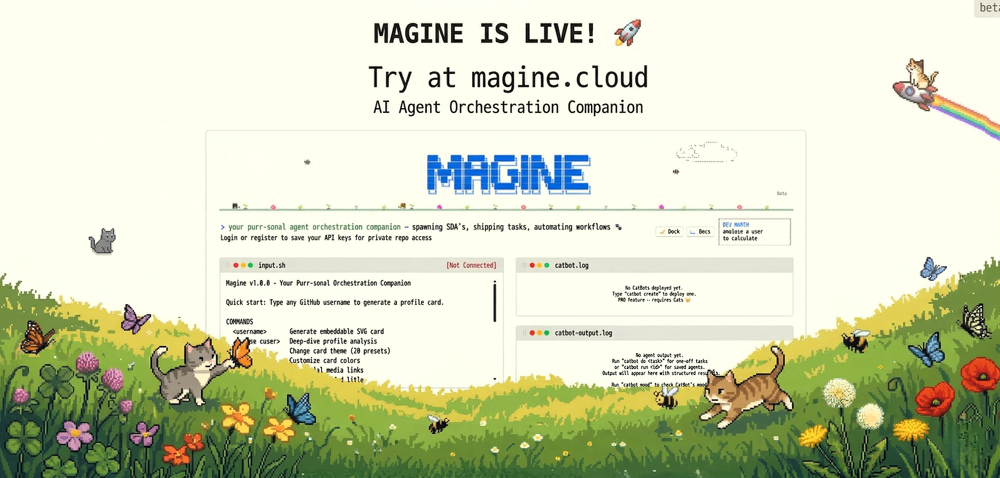
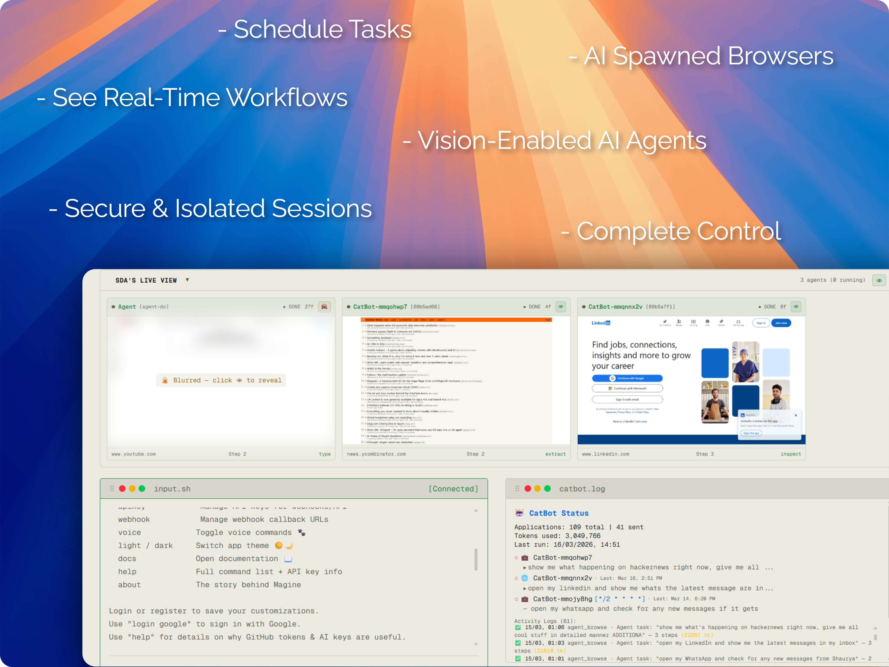

<div align="center">

# 😸 Magine - A Terminal-Styled AI Orchestration Platform

### _iMagine what your AI could do while you sleep_ 🐾

**analyze anything. automate everything. from your terminal.**

<br />

<a href="https://www.producthunt.com/products/magine?embed=true&amp;utm_source=badge-featured&amp;utm_medium=badge&amp;utm_campaign=badge-magine" target="_blank" rel="noopener noreferrer"></a>

<br />

[Live Demo](https://magine.cloud) · [Docs](https://magine.cloud/docs) · [Features](#features) · [Story](#the-story-of-magine) · [Commands](#terminal-commands) · [Agents](#ai-browser-agents) · [Pricing](#pricing)

</div>

---

**Magine** is a retro-terminal web interface for deep GitHub profile analysis, AI-powered browser automation, and scheduled agent workflows - all controlled from a single command-line-inspired UI.

Think of it as your personal command center: type a GitHub username and get an instant deep dive on a developer, or spin up autonomous browser SDAs (Sight-Driven Agents) that can see, navigate, interact, and report back - on a schedule or in real time. Send scheduled posts to LinkedIn, get a summary of your X (Twitter) feed, triage your Gmail inbox, or automate any web task you can _iMagine_.

---

## The Story of Magine

> _iMagine a world where AI agents can actually see._

Most AI agents today are **blind as a bat** 🦇. They rely on APIs, structured selectors, and DOM scraping - meaning the moment a website changes a class name or moves a button, everything breaks. That fragility is why autonomous browser automation has been stuck in demo mode for years.

**Magine** was born to fix this. Instead of teaching agents to parse HTML, we built **Sight-Driven Agents (SDAs)** - autonomous browser agents that literally _see_ the screen. They take real-time video capture, feed them to our models & MOEs, plan their next move based on what they observe, and then act - just like a human would.

### 🐱 Why Cats?

Cats see things humans miss. Just as cats perceive movements invisible to us, **Magine's** SDAs perceive web interfaces that traditional agents cannot navigate - login walls, CAPTCHAs, dynamic pages, and visual content with no API. Cats are independent, observant, and self-sufficient. So are **Magine's** SDA's or we named it **catbots**.

### How SDAs Work

An SDA creates **Action Streams**: a continuous loop of frames and video capture → vision-model planning → GUI and API actions executed. Every step is recorded, so you can scrub through an sda's work frame by frame.

### Under the Hood

- **Self-Reinforced Learning** - agents learn from their own successes and failures across runs
- **Short-Term & Long-Term Memory** - agents remember context within a session and across sessions and use it to improve over time
- **Isolated Sandboxes** - every user session runs in its own containerized custom browser environment
- **Mixture of Experts (MoE)** - Magine's native models, cloud models, and specialized vision models run in parallel for faster, more accurate decision-making
- **GitHub Productivity Tracker** - beyond browsing, Magine analyzes developer profiles with AI-driven scoring and market-value estimation

### Where SDAs Are Used

SDAs are already powering real workloads on providers like [Zeupiter](https://zeupiter.com) - from automated cost management to Gmail triage to full **vibe deployments**: describe what you want in plain English, and an SDA plans, tests, and ships it.

---

## How Magine Works

<div align="center">

<br />
<sub><em>Magine SDAs: vision-enabled agents that see, think, and act - on any website.</em></sub>
</div>
<br />

```
┌─────────────────────────────────────────────────────┐
│  magine terminal                                    │
│  ─────────────────────                              │
│  > analyze torvalds                                 │
│                                                     │
│  Fetching GitHub data...                            │
│  Running AI analysis...                             │
│  ┌───────────────────────────────────────────┐      │
│  │ ★ Profile Score: 98/100                   │      │
│  │ 📊 Top Languages: C, Shell, Perl          │      │
│  │ 🔥 Contribution Streak: 4,021 days        │      │
│  │ 💡 AI Insight: "The most prolific..."     │      │
│  └───────────────────────────────────────────┘      │
│                                                     │
│  > catbot create "daily-monitor"                    │
│  Agent created. Use `catbot task` to assign work.   │
│                                                     │
│  visitor@magine:~$ _                                │
└─────────────────────────────────────────────────────┘
```

## Features

### 🔍 GitHub Profile Analysis - _iMagine knowing any developer in seconds_

- **Instant analysis** - type any GitHub username to get a comprehensive profile breakdown
- **AI-powered insights** - ai-driven deep analysis of contributions, repos, and coding patterns
- **Profile scoring** - 0–100 rating based on activity, impact, and community engagement
- **Beautiful cards** - generate shareable GitHub profile cards with stats, No building of resumes.

### 🤖 Sight-Driven Agents (SDAs) - _iMagine an army of cats browsing for you_

**Browser Sandbox Architecture**

Each user session runs inside a sandboxed browser environment with:

- **Containerized execution** - isolated environment per user
- **Self-reinforced learning** - agents improve from their own successes and failures
- **Mixture of Experts (MoE)** - Magine's native models, cloud models, and vision models run in parallel for faster decision-making
- **Multi-tab automation** - parallel workflows across tabs
- **Secure credential handling** - prompt-based auth when agents need to log in

**Agent Capabilities:**

- **Autonomous browsing** - AI agents navigate real browsers using Playwright
- **Live video frames** - watch agents work in real time via the SDA Live Viewer
- **Task assignment** - give natural language instructions: _"go to LinkedIn and check my notifications"_
- **Multi-site support** - Gmail, LinkedIn, YouTube, and any website
- **Credential management** - secure prompt-based auth when agents need to log in
- **Frame-by-frame replay** - review every step your agent took with thumbnail navigation

**Quick Tasks - just tell CatBot what to do:**

```bash
catbot do "check NVIDIA stock price on Yahoo Finance"
catbot do "order Sony WH-1000XM5 headphones from Amazon and pay using my card"
catbot do "send an email on Gmail to Arthur about yesterday's meeting"
catbot do "search arXiv for latest transformer-based LLM papers from 2026"
catbot do "whats the latest Veritasium video is all about on youtube"
catbot do "apply to senior frontend developer jobs on Indeed"
catbot do "research the best Mumbai street food on Reddit"
catbot do "send KFC memes on my WhatsApp to Domino's"
catbot do "check what's happening on my X (Twitter) feed"
```

Otherwise create a dedicated agent using the `catbot create` command.

### ⏰ Smart Scheduling - _iMagine your agents running while you nap_

- **Natural language scheduling** - say _"every weekday at 9am"_ instead of writing cron expressions
- **AI cron parser** - LLM-powered conversion of human language to precise cron schedules
- **Preset schedules** - quick options: hourly, daily, twice daily, weekdays, every 6h/12h
- **Heartbeat mode** - watch for changes on any page and get notified
- **Timezone-aware** - schedules respect your local timezone

### 🎨 Terminal Experience - _iMagine your perfect terminal aesthetic_

- **Light mode** - clean, modern light theme inspired by github
- **Voice commands** - click the paw button or type `voice` to speak commands
- **Draggable panels** - arrange your workspace with resizable terminal windows
- **Command history** - arrow keys to navigate previous commands
- **Mobile responsive** - full experience on phones and tablets

### 💰 Token Economy - _iMagine unlimited analysis power_

- **Free tier** - every visitor gets tokens to start analyzing
- **Token consumption** - different actions cost different amounts
- **Top-up** - purchase additional tokens when you need more
- **Blurred previews** - see what premium analysis looks like before buying

### 🔐 Authentication - _iMagine secure access everywhere_

- **Local accounts** - register with username/password
- **Google OAuth** - one-click sign in with Google
- **QR Login** - scan a QR code from your phone to log in on desktop
- **Session management** - secure token-based sessions

---

## Terminal Commands

### Core Commands

| Command             | Description                                                         |
| ------------------- | ------------------------------------------------------------------- |
| `<username>`        | Type any GitHub username to generate an embeddable SVG profile card |
| `analyze <user>`    | Deep-dive analysis — score, heatmap, stack breakdown                |
| `help`              | Show full command list with descriptions                            |
| `about`             | The story behind Magine                                             |
| `docs`              | Open the documentation page                                         |
| `clear`             | Clear terminal output                                               |
| `exit`              | Close the terminal (mobile)                                         |
| `analyze --refresh` | refetch (purge profile cache)                                       |

### Profile Card Customization

| Command         | Description                                                          |
| --------------- | -------------------------------------------------------------------- |
| `theme`         | Change card theme (20+ presets)                                      |
| `customize`     | Customize card colors (bg, text, accent)                             |
| `social`        | Add social media links to your card                                  |
| `bio`           | Set your job title and bio                                           |
| `preview`       | Preview current card settings                                        |
| `preview <opt>` | Toggle card sections: `ai`, `activity`, `deep`, `social`, `devworth` |

### Account & Tokens

| Command         | Description                                        |
| --------------- | -------------------------------------------------- |
| `login`         | Login with username or email                       |
| `login google`  | Sign in with Google                                |
| `register`      | Create a new account                               |
| `forgot`        | Reset password (via GitHub token)                  |
| `logout`        | Sign out of your session                           |
| `whoami`        | Show current user info                             |
| `credentials`   | Update your GitHub token / AI key                  |
| `tokens`        | Check your token balance & usage                   |
| `topup`         | Purchase token packages (Dodo Payments / PayPal)   |
| `request <msg>` | Request credits, report bugs, or share feedback 🐾 |

### AI Browser Agents (CatBot)

| Command                                 | Description                                      |
| --------------------------------------- | ------------------------------------------------ |
| `catbot create <prompt>`                | Create a new AI browser agent                    |
| `catbot create sda <prompt>`            | Create a vision-enabled SDA agent                |
| `catbot list`                           | List all your agents with status                 |
| `catbot task <id\|name> <task>`         | Assign a natural language task to an agent       |
| `catbot run <id\|name>`                 | Run a CatBot (agent or SDA)                      |
| `catbot do <prompt>`                    | Quick one-off browser task (always starts fresh) |
| `catbot continue`                       | Resume a previously paused quick task            |
| `catbot do stop`                        | Cancel a running quick task                      |
| `catbot schedule <id\|name> <schedule>` | Set a recurring schedule (NL, preset, or cron)   |
| `catbot delete <id\|name>`              | Permanently remove an agent                      |
| `catbot mode <id\|name>`                | Switch CatBot mode (agent / SDA)                 |
| `catbot prompt <id\|name>`              | Set or change agent task prompt                  |
| `catbot memory`                         | View saved browsing memories                     |
| `catbot memory delete <site>`           | Delete memory for a specific site                |
| `catbot memory clear`                   | Clear ALL agent memories                         |
| `catbot logs`                           | View CatBot activity logs                        |
| `catbot stats`                          | View CatBot statistics                           |
| `catbot mood`                           | Check CatBot mood & state                        |
| `catbot treat`                          | Reward CatBot (positive feedback)                |
| `catbot scold`                          | Correct CatBot (negative feedback)               |
| `catbot linkedin`                       | Link LinkedIn browser session                    |
| `catbot email`                          | Check GitHub email extraction                    |

### LinkedIn SDAs

| Command                           | Description                     |
| --------------------------------- | ------------------------------- |
| `linkedin login`                  | Open browser for LinkedIn login |
| `linkedin status`                 | Check session status            |
| `linkedin profile <url>`          | Get a person's profile          |
| `linkedin company <name>`         | Get a company's profile         |
| `linkedin jobs <query>`           | Search for jobs                 |
| `linkedin job <url>`              | Get job details                 |
| `linkedin apply <url>`            | Apply to a job (Easy Apply)     |
| `linkedin people <query>`         | Search for people               |
| `linkedin post <text>`            | Create a LinkedIn post          |
| `linkedin article <text>`         | Create a LinkedIn article       |
| `linkedin follow <url>`           | Follow a person                 |
| `linkedin connect <url>`          | Send a connection request       |
| `linkedin block <url>`            | Block a person                  |
| `linkedin bulk-follow <keyword>`  | Auto-follow people by keyword   |
| `linkedin bulk-connect <keyword>` | Auto-connect people by keyword  |
| `linkedin tools`                  | List all available SDA tools    |
| `linkedin close`                  | Close browser session           |
| `linkedin clear`                  | Close ALL browser sessions      |

### Webhooks & API

| Command                             | Description                           |
| ----------------------------------- | ------------------------------------- |
| `apikey create [name]`              | Generate a new API key (max 5 active) |
| `apikey list`                       | List your active API keys             |
| `apikey revoke <id>`                | Revoke a key permanently              |
| `webhook register <endpoint> <url>` | Register a webhook callback URL       |
| `webhook test <endpoint>`           | Send a test delivery                  |
| `webhook status <endpoint>`         | Check webhook config                  |
| `webhook remove <endpoint>`         | Remove callback URL                   |

### Settings & UI

| Command                   | Description                               |
| ------------------------- | ----------------------------------------- |
| `light` / `dark` / `mode` | Switch between light and dark themes      |
| `voice`                   | Toggle voice commands (speech-to-text) 🐾 |
| `timezone`                | Show or set timezone (IANA format)        |
| `history`                 | Show command history (↑/↓ to navigate)    |
| `history clear`           | Clear saved command history               |

---

## AI Browser Agents

CatBot agents are autonomous browser instances powered by SDAs. Each agent gets its own real cloud browser and can:

1. **Navigate** - go to any URL
2. **Click** - interact with buttons, links, and menus
3. **Type** - fill forms, compose messages, and search
4. **Scroll** - explore long pages
5. **Read** - extract text and understand page content
6. **Screenshot** - capture what it sees at every step
7. **Wait** - pause for pages to load or auth flows to complete
8. **Log in** - request credentials securely when authentication is needed

### Agent Workflow

```
Create Agent → Assign Task → Agent Opens Browser → Executes Steps
     ↓              ↓               ↓                    ↓
  catbot create   catbot task    Live View (SDA)    frames saved
     ↓              ↓               ↓                    ↓
  Schedule it    NL instructions  Watch in real-time  Review frames later
```

### Scheduling Examples

```bash
# Using presets
catbot schedule <id|name> daily
catbot schedule <id|name> every_hour
catbot schedule <id|name> weekdays_9am

# Using natural language (AI-parsed)
catbot schedule <id|name> every monday at 8am
catbot schedule <id|name> twice a week on tuesday and friday
catbot schedule <id|name> every 30 minutes
catbot schedule <id|name> first day of every month

# Using raw cron
catbot schedule <id|name> 0 */6 * * *
```

---

## Pricing

| Package | Tokens                   | Price |
| ------- | ------------------------ | ----- |
| Free    | 1,000,000 starter tokens | \$0   |
| 1 Cat   | 5,000,000 tokens         | \$5   |
| 5 Cats  | 20,000,000 tokens        | \$15  |
| 10 Cats | 50,000,000 tokens        | \$25  |
| 50 Cats | 200,000,000 tokens       | \$100 |

_Token costs vary by action. Profile analysis uses fewer tokens than deep AI analysis or browser agent tasks. Use the `topup` command in the terminal to purchase more, or use `request` to ask for free credits._ 🐱

---

## REST API & Webhooks (Experimental)

Magine provides a **REST API** for triggering agents and retrieving results, plus **real webhooks** that push results to your server.

### API Key Setup

```bash
> apikey create my-integration
> apikey list
> apikey revoke <key-id>
```

### REST API - Trigger Agent (POST)

```bash
curl -X POST https://magine.cloud/api/catbots \
  -H "Authorization: Bearer mk_..." \
  -H "Content-Type: application/json" \
  -d '{"botId": "<id>", "additionalPrompt": "optional extra tasks"}'
```

The `additionalPrompt` field appends extra tasks to the agent's base prompt (never overrides it).

### REST API - Get Results (GET)

```bash
curl https://magine.cloud/api/catbots?botId=<id>&limit=5 \
  -H "Authorization: Bearer mk_..."
```

Returns paginated run results with `steps`, `summary`, `tokensUsed`, and structured `output`.

### Real Webhooks (Push to Your Server)

Register a callback URL and Magine will POST results to your server whenever an agent run completes:

```bash
> webhook register <endpoint> https://your-server.com/webhook
> webhook test <endpoint>     # Send a test delivery
> webhook status <endpoint>   # Check webhook config
> webhook remove <endpoint>   # Remove callback URL
```

Webhook deliveries include an `X-Magine-Signature` header (HMAC-SHA256) for verification.

**n8n Integration**: Use a Webhook node (push) or HTTP Request node to POST to `/api/catbots` (pull).

---

## Security & Privacy

- **API keys** are encrypted with AES-256-CBC at rest
- **Browser sessions** runs in an isolated cloud sandboxed containers with automatic TTL cleanup
- **Agent credentials** are held in memory only during execution and never persisted to disk
- **Session tokens** are cryptographically random with TTL-based expiration
- **We do not sell or share your data** - ever

---

## Self-Hosting (Coming Soon - Magine wants support to make it happen)

We plan to open source Magine for self-hosting in the future, but it requires significant support and security work to ensure safe operation outside our managed environment. If you're interested in self-hosting, do star & [raise issue](https://github.com/S4nfs/Magine/issues) and follow us.

<div align="center">

<sub>Built with 💗 & obsessive attention to terminal aesthetics</sub>

</div>
